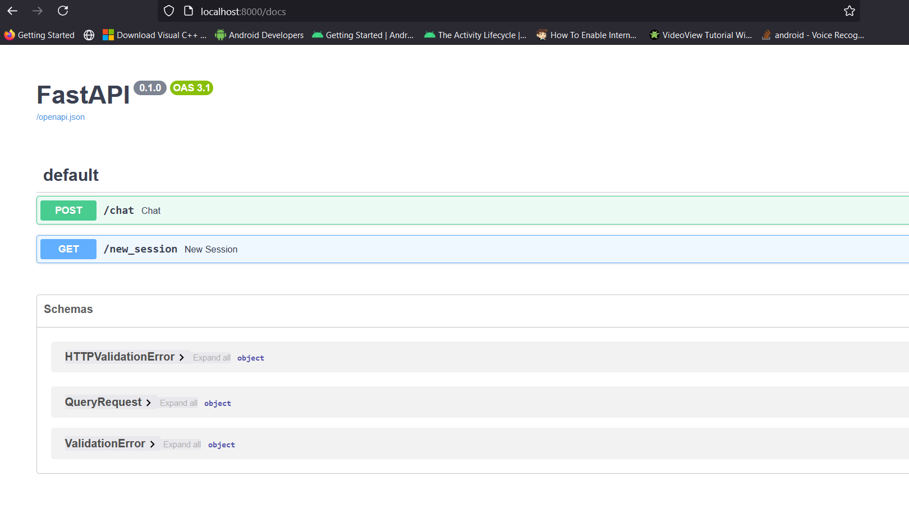
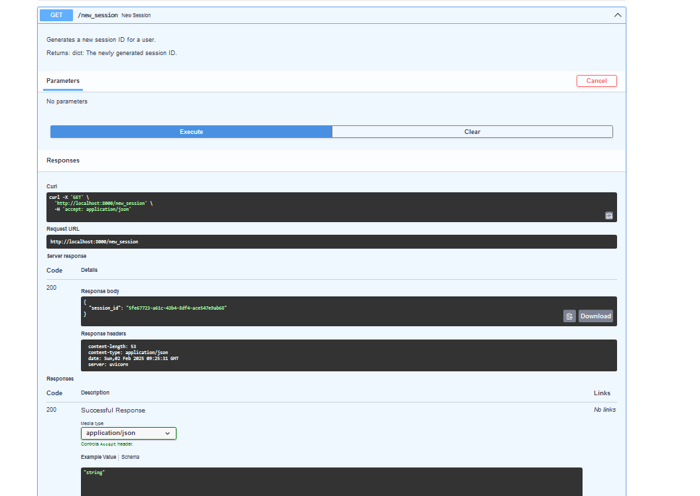
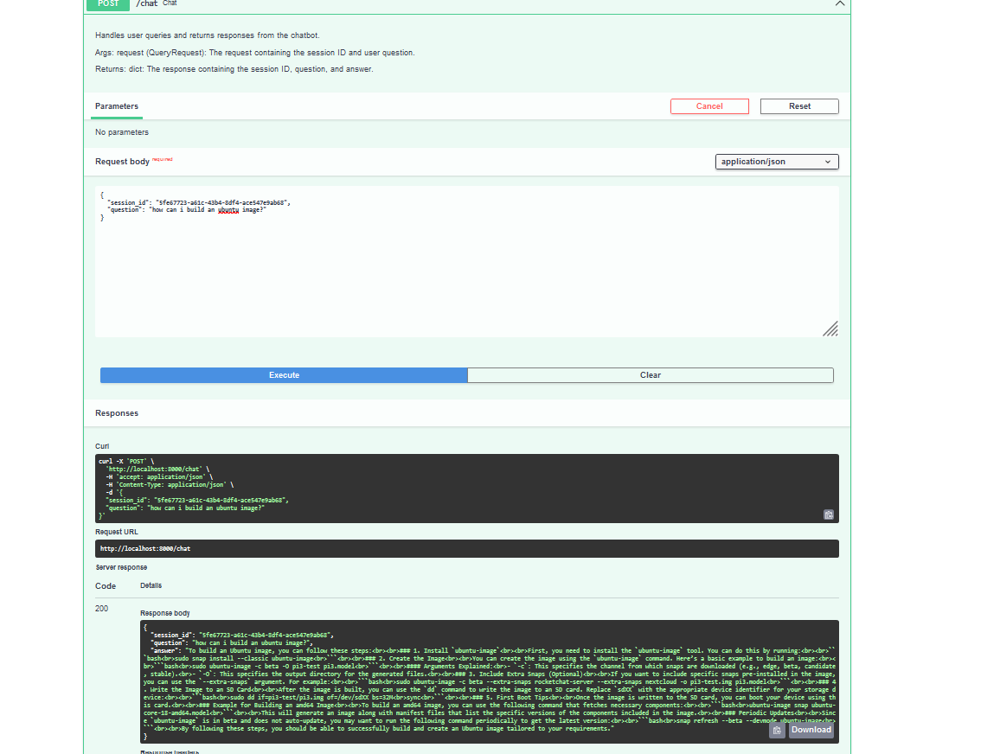
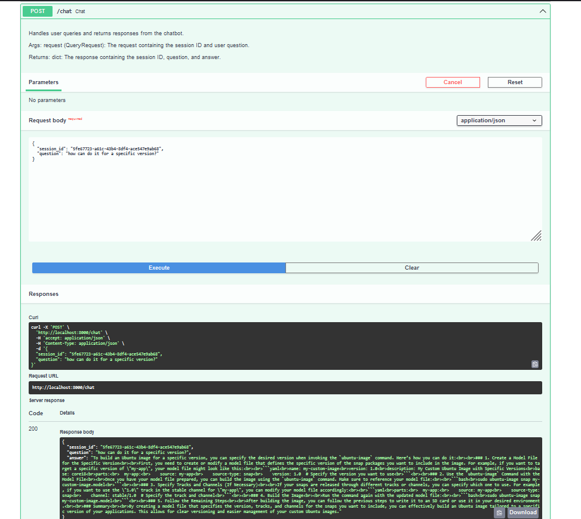
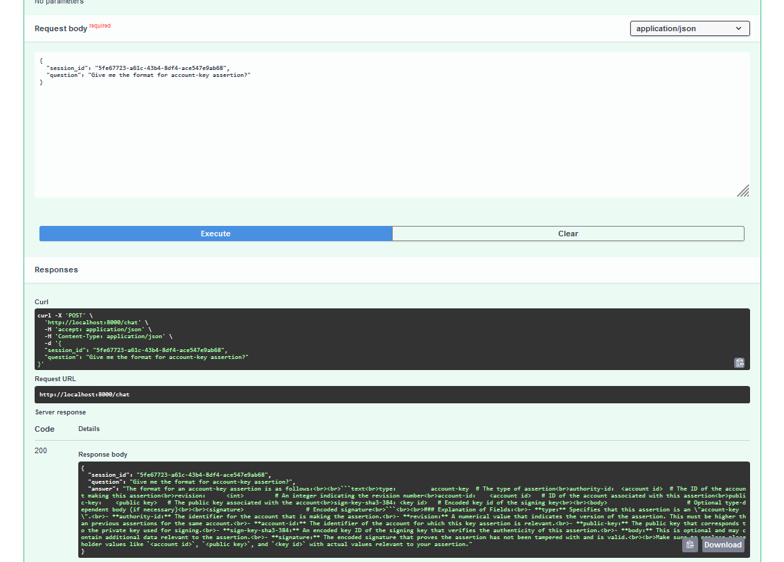
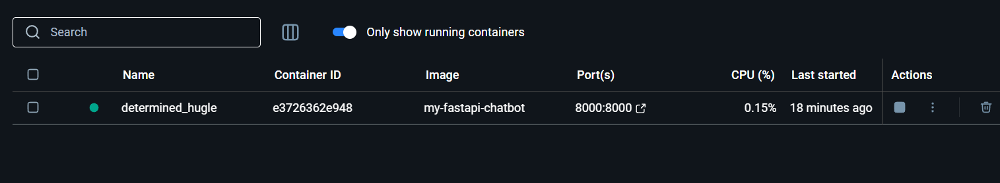

# Docker Deployment and Swagger Test Report
## Overview

In this task, I deployed the FastAPI-based chatbot application using Docker. The goal was to containerize the solution and test the functionality of the application via the Swagger UI. The app was successfully deployed, and I was able to interact with the endpoints through the Swagger documentation.

## Steps Taken

1. **Dockerizing the Application:**
   - The application was containerized by creating a `Dockerfile`.
   - The Dockerfile installs the necessary dependencies from `requirements.txt`, copies the application files, and runs the FastAPI app using Uvicorn.
   
2. **Building the Docker Image:**
   - I built the Docker image with the following command:
     ```bash
     docker build -t my-fastapi-chatbot .
     ```

3. **Running the Docker Container:**
   - I started the container with the command:
     ```bash
     docker run -d -p 8000:8000 my-fastapi-chatbot
     ```

4. **Testing via Swagger:**
   - After the container started, I accessed the Swagger UI at:
     ```bash
     http://localhost:8000/docs
     ```
   - I tested the `/chat` and `/new_session` endpoints to confirm they were functioning correctly.

## Test Results

### Screenshot 1: Swagger UI - OpenAPI Documentation

This screenshot shows the FastAPI Swagger UI where all the available endpoints are listed. You can see the `/chat` and `/new_session` endpoints.



### Screenshot 2: Swagger UI - Sending a Request to `/new_session`
This screenshot shows the Swagger UI where I successfully created a new session by calling the `/new_session` endpoint.



### Screenshot 3: Swagger UI - Sending a Request to `/chat`

This screenshot demonstrates a successful interaction with the chatbot. A query was sent, and the response was received without any errors.







## Conclusion

The Dockerized FastAPI chatbot application was successfully deployed and tested. The Swagger UI was used to test the endpoints, and the application responded as expected. The deployment is now ready for further use or integration into a production environment.

### Other screenshots:

Docker running app:


---